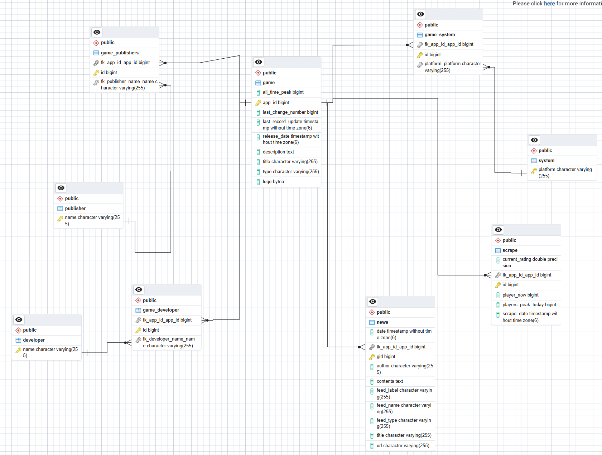

# Dat3-SP2

## Group

- Magnus
- Peter
- Sidsel
- Yusuf

## EER Diagram

## Links

We have utilized following links:
- SteamDB: https://steamdb.info/
- SteamAPI:
  - Docs: https://partner.steamgames.com/doc/webapi
  - GetNewsForApp: https://api.steampowered.com/ISteamNews/GetNewsForApp/v2/

## Considerations

We had a lot of discussion about whether the persistences should be directly in the webscraper, since the webscraper is the only one using the data. We decided to make a separate persistence layer, since it would be easier to test and maintain and to make our program more future-proof if we in the future want to hande more data from different sources.

### Edge cases
- We use switchcase to handle the output of information, since for example; Source SDK Base 2007 only has 4 rows of info while others could have 8 or more
- Some elements in an entity dont have unique values, therefore we check whether or not the element exists already, if not we create a new entry - otherwise we refer to the preexisting entry

### Error handling

- We use runtime exceptions to handle errors since our errors are few. If we could have taken data from steamDB then we would have done our error handling differently using try-catches, but since we only use static informaton from the website in our project, we just keep the error handling on a low level

### Potential improvements

- Right now our WebScaper class is somewhat "closed" since we instantiate the Game objects from within the class. We could have potentially made a DTO or something alike that would return from the WebScaper class and then create the Game objects somewhere else. So in other words we would have been able to make a fairly generic interface for the WebScraper class which would return the type DTO if at any point we needed to scrape other websites.

